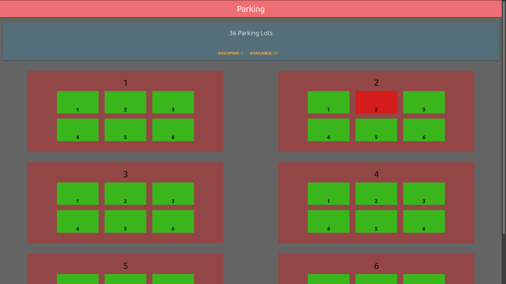

## Smart Car Parking Project for ATL
This project has three parts:
1. **Server**: For managing towers.
2. **Frontend**: To track the parking lots.
3. **Flutter**: A cross-platform mobile app made using Google Flutter.
4. **Arduino**: Arduino Code for controlling the towers.

The smart parking is divided into *tower*s and each *tower* is divided into parking lots called as *index*es or indices.
****
### Table of Contents
- [Installation](#installation)
- [Server](#server)
- [Frontend](#frontend-realtime-tracking)
- [Flutter](#flutter)
- [Arduino](#arduino)
- [Authors](#authors)
- [Members](#members)
- [Credits](#credits)
****
### Installation
Yet to be added

### Server
This is an express app with the following endpoints. The default port is `3000`.

* `/test` (GET): Will respond with a string "hello tester". Logs the IP address of the request in the console.
* `/test` (POST): Will respond with the following JSON object `{"str": "hello tester"}". Logs the IP address of the request in the console.
* `/trackTowers` (GET): Returns limited information about the towers as a JSON object.
* `/addCar` (POST): Adds a car.
The following properties are required in the request body.
```js
{
	ownerName: <String>, // Name of the car owner as a string
	towerLocation: <Integer>, // 0 indexed tower ID
	parkIndex: <Integer> // 0 indexed ID of the parking location in a tower
}
```
Return value is a JSON object with the following data
```js
{
	success: <String>, // Success code as a string, it can be {'success', 'failed'}
	error: <String>, // Returns the error if an error has occured
	passkey: <Integer>, // Returns a password if the car was added successfully
	QrUrl: <String> // URL to a qr code containing the password
}
```
* `/removeCar` (POST): Removes a car from a parking lot.
The following properties are required in the request body.
```js
{
	towerLocation: <Integer>, // 0 indexed tower ID
	parkIndex: <Integer>, // 0 indexed ID of the parking location in a tower
	passkey: <Integer> // Passkey for the parking lot
}
```
Return value is a JSON object with the following data
```js
{
	success: <String>, // Success code as a string, it can be {'success', 'failed'}
	error: <String> // Returns the error if an error has occured
}
```

### Frontend (realtime tracking)



This is a simple website written in HTML, CSS, JS using Materialize and JQuery.

The script `frontSync` copies all of the frontend code into `/var/www/html/carParking/` for a linux system with Apache server configured.
To run the script periodically, run `watch -n [time-in-sec] ./frontSync`.

### Flutter
Yet to be added

### Arduino
Yet to be added

****
### Authors
- Harsh Khandeparkar - [**@HarshKhandeparkar**](https://github.com/HarshKhandeparkar)

### Members
- Harsh Khandeparkar (contributor) - [**@HarshKhandeparkar**](https://github.com/HarshKhandeparkar)
- Sahil Patel (contributor) - [**@sahil-patel6**](https://github.com/sahil-patel6)
- Omkar Sawant (hardware)
- Shlok Zambrekar (hardware)

### Credits
Yet to be added


> By Atal Tinkering Lab Ponda, Goa
